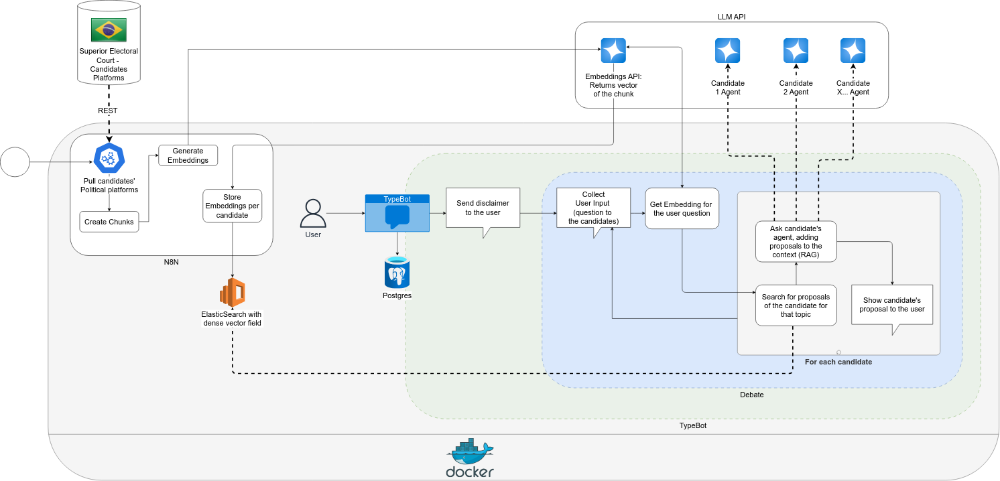

# São Paulo Open Political Debate Project

Welcome to the **Open Political Debate** project — an open-source initiative designed to promote transparency, accessibility, and civic engagement for the 2024 **São Paulo Mayoral Election**.

Our goal was to allow citizens to **ask questions directly to candidates**, and get **responses based on the candidates' officially registered political platforms**, fairly and without bias.  
This project empowered voters with information, helping create a more informed electorate.

You can give it a try at [https://bot.auto.ronaldo.blog.br/debate-sampa](https://bot.auto.ronaldo.blog.br/debate-sampa). (It is available in Portuguese, but you can ask it "please answer in English" and it will do so.)

---

## How It Worked

This project automated the collection, processing, and interaction with candidates' political proposals through a chatbot, powered by AI and public data.

Here's a step-by-step flow:

### 1. **Collecting Candidate Proposals**
- We **automatically pulled** political platforms from the **Superior Electoral Court (TSE)** using their public **REST API**.
- Platforms were **split into chunks** to make processing manageable.
- Each chunk was processed to **generate an embedding** — a numerical vector representation of the text.

### 2. **Storing Embeddings**
- The embeddings were saved in an **ElasticSearch** instance with a **dense vector field**, allowing for efficient semantic search.

### 3. **User Interaction (Debate Interface)**
- Through a chatbot built with **TypeBot**, users could:
  - Read a **disclaimer** about how the system worked.
  - **Submit a question** to the candidates.

### 4. **Answer Generation (Debate Phase)**
- The user's question was converted into an embedding.
- The system **searched for proposals** from each candidate that matched the question topic.
- A **contextual prompt** was created for each candidate, enriched with relevant proposals (Retrieval-Augmented Generation, or RAG).
- A **dedicated AI agent** for each candidate formulated a response based on their political platform.
- The system **returned the candidates' answers** side-by-side for the user to compare.

---

## Technical Stack

| Technology | Purpose |
|:---|:---|
| **n8n** | Automated workflows: pulling data, chunking texts, generating embeddings |
| **ElasticSearch** | Stored embeddings for fast semantic search |
| **TypeBot** | Built the conversational interface for voters |
| **PostgreSQL** | Stored conversation metadata |
| **Docker** | Containerized and orchestrated the full solution |
| **Custom LLM Agents** | Generated candidate-specific responses |
| **TSE API** | Provided the official candidate platforms |

---

## Social Impact

- **Transparency:** Responses were grounded in candidates' official proposals — no hallucinations or fake content.
- **Fairness:** Every candidate received equal treatment through a standardized process.
- **Civic Engagement:** Encouraged citizens to engage thoughtfully with electoral content.
- **Open Source:** Everything was developed transparently so that it could be audited and reused for future elections.

---

## Diagram

